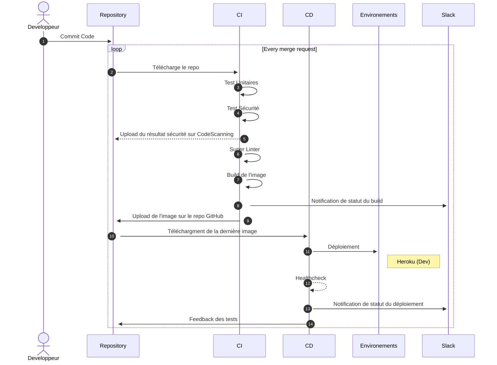

## 📍 Introduction

Nous avons reçu la mission de faire une pipeline CICD sur un projet Node.JS. 

Le code était sur GitHub donc nous avons décidé de faire une pipeline 100% github.
Dans un but de minimiser la friction de la mise en place de la dit pipeline et sa mise en prod.

Cela colle à la philosophie devops qui est de rendre un cycle de développement le plus court possible.
- Une plus grande rapidité dans le développement de l'application
- Une livraison plus rapide du produit
- Une augmentation de la fiabilité du produit 
- Une évolutivité constante 
- Une collaboration accrue entre les devs et les Ops
- Un accent sur la sécurité


Concernant Git :
Nous avons décidé de protéger la branche main.

Deux conditions s'appliquent grâce aux options du repo : 
1. Nous avons besoin de faire un pull request avant de mergé sur la 'main'.
2. 2 personnes doivent review la pull request.

Cela assure une qualité de code et de fonctionnement du projet car la pipeline CI s'active sur chaque pull request et chaque nouveau commit sur cette dernière.

La pipeline CI nous permet de vérifier le bon fonctionnement du projet à chaque instant.

Avec ces trois conditions, nous nous assurons un bon fonctionnement du projet avant de merger sur la main branche.
La branche main représente donc pour nous l'environnement staging et prod.

Le concept de CICD ♾️ est respecté et permet un cycle de développement de l'application rapide et à haute intensité.


## GitHub Actions en Bref

Le fonctionnement de GitHub Actions:


## 🧮 Les fonctionnallités de la pipeline
Nous avons 3 pipelines, Dev, Staging puis Prod

### ⛹️‍♂️ La pipeline CI étape par étape

- On récupère le contenu de notre repository
- On installe Node.JS 
- On vérifie le contenu du cache
- On installe les dépendances
- On lance le serveur Node.JS
- On lance les tests unitaires
Puis si cela fonctionne on passe à la sécurité :
- On lance l'utilitaire snyk qui vérifie s'il y a d'éventuelles vulnérabilités
- On upload le résultat sur CodeScanning, un service disponible sur GitHub directement dans notre repo. Le résultat est aussi disponible sur notre compte Snyk.io
S'il n'y a aucunes vulnérabilités, on passe à l'étape du Linter.
- On récupère le contenu du repository.
- On vérifie le repo avec super-linter qui vérifie la qualité du code.
Puis on passe à l'étape du build de l'image
- On build l'image avec BuildX
- On la push sur le package repository associé à notre répo github.
Puis pour finir, la dernière étape consiste à notifier le résultat sur slack.

Une fois les tests finit, on regarde ensemble pour mérger la pull request.
Si la pull request est mergé, la pipepine staging s'enclenche.

### 🤾‍♂️ La pipeline CD

- On récupère le package sur le repo github 
- On le deploy sur heroku
- On fait un healthcheck pour s'assurer du bon fonctionnement
- On envoie une notification sur Slack

### 🌠 La pipeline CD : Staging et Prod

- On upload sur un EC2 AWS
- On réalise un healthcheck pour vérifier le bon fonctionnement du déploiement
- On monitor avec CloudWatch sur AWS 


## 🔬 Installation pipeline

- Télécharger les fichiers ci.yml et cd.yml 
- Avoir un compte AWS et Heroku
- Faire deux EC2 avec le bon user-data.sh en exécution
- Assurez-vous d'avoir les bonnes variables d'environements


### Pipeline Prod


## 🖥️ Le stack du site web

**Client:** HTML, CSS

**Serveur:** Node, Express


## ♾️ Le stack de la pipeline

**Conteneurisation:** Docker

**Hébergement:** Heroku et AWS

**Sécurité:** Snik

**Linter:** Super Linter

**Registre de container:** GitHub Registry container

**WebHook:** Slack

## 🔀 Diagramme séquentielle de la pipeline Dev




## 💻 Pour installer le projet en local

Vous pouvez installer le projet avec le gestionnaire de paquage npm.
Vous avez besoin d'un serveur Node.JS avec la version 14.16

```bash
git clone https://github.com/[GIT_ID]/bdx-groupe-1
cd bdx-groupe-1
npm install
npm run start
git add . 
git commit -m "first commit" 
git push origin [PrénomNom]
```

## 📝 Auteurs

- [@arnaudtron](https://www.github.com/arnaudtron)
- [@karim](https://www.github.com/styldown)
- [@gatienboquet](https://www.github.com/gatienboquet)

## 🔔 Badges

[](https://github.com/tterb/atomic-design-ui/blob/master/LICENSEs)
[](https://opensource.org/licenses/)
[](http://www.gnu.org/licenses/agpl-3.0)


### 


## 🔐 Les variables d'environements 

Pour pouvoir assurer le fonctionnement de la pipeline CICD, vous avez besoin de définir certaines variables. 
Ces variables sont confidentielles, assurez-vous de ne pas les divulguer publiquement.

`HEROKU_API_KEY` : La clé API pour déployer sur Heroku

`SNYK_TOKEN` : La clé pour l'analyse du code avec Snyk

`TOKEN_REPO` : La clé pour l'upload et le téléchargement depuis le GitHub Packages

`SLACK_WEBHOOK_URL` : Le lien du webhook Slack pour les notifications

`AWS_PRIVATE_KEY` : La clé privé du serveur EC2 d'AWS

`HOSTNAME_PROD` : Le nom d'hote du serveur EC2 d'AWS pour la Prod

`HOST_NAME_STG` : Le nom d'hote du serveur EC2 d'AWS pour le staging

`USER_NAME`: L'username du serveur EC2 d'AWS
## 📚 Leçons apprises

Github Actions ne faisait pas partie du cursus de notre formation; nous avons pu découvrir les fonctionnalités que github proposent et approfondir nos connaissances de création de pipeline cicd dans une technologie nouvelle.

## 👏 Remerciements

 - [Ulrich MONJI](https://github.com/ulrichmonji)
 - [Git Workflow](https://medium.com/@patrickporto/4-branching-workflows-for-git-30d0aaee7bf)
 - [How to write a Good readme](https://bulldogjob.com/news/449-how-to-write-a-good-readme-for-your-github-project)
 - [Mermaid Live Editor](https://mermaid.live/edit#pako:eNqFVMFu2zAM_RVCl3VY9wM-9LA4WwIMOyzrzRdFZhIitqRKVICg6P8s3-EfG-W4SZykmA0YJvn4-EhTflXG1agKFfEloTVYkl4H3VYW5NKJnU3tEsNgG3YBStxh47zHNLi9DkyGvLYMv9G7SALb38Ymc7jjLG99U7uj4Cy2aDnehheNNtuj-0LL16enL-fqBUxc25LwS39D2cY5D9Mdhj20GNYIITcd-RjN1zk_s03mBfzpDk13MBud8U1O8e6Mn8xPOOGBZ0usKWD8ELEQrhSIu8MIcq392TdO11AnCN0hpoY1QzylQkyh72thtLVk1_fKLZLHAD_J8vvXG8e_JWqkgjT1iVq9xmtMP-QCfjmmFRnN5GxGR5GSOCtbZoLrrHtNnEr0uocZwg_iWVp-OPpyNPq8CD2Rlmew1P0NCEfOCwVlzhztTgFldxAZ1JtnqHQlMmi9YXAruEqZYXDbBA-yW59H7EKfdc1QN7wxGzTbm-r_nVp9V0-ffDm774j1UqgkOQLL5gwrhVZGnu9sqEcle9xqquUAv2ZfpXgj1JUq5LXWYVupyr4JLvlaM07rTK8KDgkfVT7di7017_YRM_wAVLHSTcS3f4AHXc4)
 - [ReadMe Editor](https://readme.so/fr/editor)
## 📜 License

[MIT](https://choosealicense.com/licenses/mit/)


## 💡 Améliorations possibles

- Rajouter une plus grosse étape sur le monitoring : AWS CloudWatch
- Avoir un linter plus rapide, comme MegaLinter
- Utiliser docker compose pour avoir moins de commandes lors du lancement dans les environements AWS
- Utiliser un loadbalancer pour éviter le downtime en staging et prod
- Rajouter une "release notes" automatique à la fin de la pipeline CI
- Utiliser CodeDeploy, un service de AWS pour le déploiement en prod
- Faire une wiki ou github pages du projet
